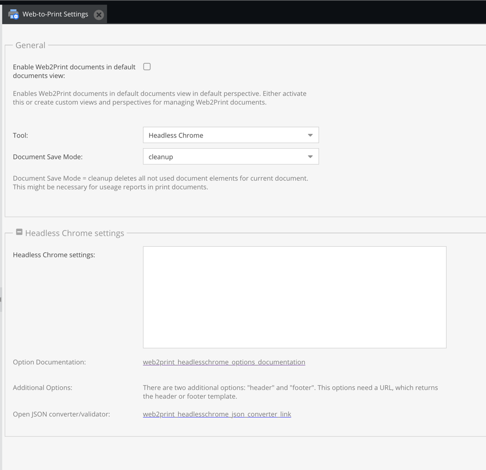

# Studio1® Web2Print Bricks

## Installation

### 1. Preparation

Your Pimcore Docker stack must be built on the current version of Studio1® Pimcore PHP Docker Image.
See: https://github.com/studio1gmbh/pimcore-docker

### 2. Use this bundle

Run following command in PHP FPM docker container:

```shell
composer require studio1/web2print-bricks
```

This adds all dependencies, too.

### 3. Enable/install Web-to-Print bundles

Run following command in PHP FPM docker container:

```shell
# ATTENTION: change to Pimcore folder *before* running following commands
bin/console pimcore:bundle:enable Web2PrintToolsBundle
bin/console pimcore:bundle:install Web2PrintToolsBundle
bin/console pimcore:bundle:enable Web2PrintBricksBundle
bin/console pimcore:bundle:install Web2PrintBricksBundle
```

### 4. Change Web-to-Print settings



### 5. Set flag "PrintPage" `true` for desired perspectives

Take the following perspective configuration as example:
[default.yaml](doc/default.yaml)

Afterwards please reload Pimcore admin backend.

## Usage

Add _PrintPage_ document and choose controller, e.g.

| **Document type** | **Controller**                                                                  |
|-------------------|---------------------------------------------------------------------------------|
| Print container   | `Studio1\Web2PrintBricksBundle\Controller\Web2printController::containerAction` |
| Print page        | `Studio1\Web2PrintBricksBundle\Controller\Web2printController::defaultAction`   |

After choosing the right controller adding bricks of this bundle via editor is possible (maybe reload GUI). 